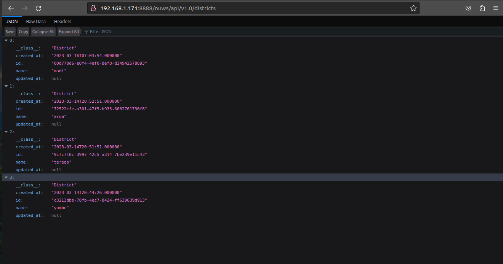

# NUWS-API-Version-1

<p align="center">
    
</p>

## Description :book:

The NUWS-API is a basic Extract-Transform-Load (ETL) data pipeline that extracts data from various field submissions, makes transforms to the data and loads it into a dedicated MYSQL server database of choice. The field submissions are collected using a data collection tool called Kobo Toolbox. You can read more about Kobo Toolbox platform here: [KoboToolbox](https://kobotoolbox.org/#home). The data collected is extracted through an Application Programming Inteface (API) provided by the platform. The data is further transformed in the backend of the application and mapped to its corresponding tables in the database.
The complete application on the backend is integrating a KoboToolbox Data collection API, an ETL data pipeline built with Python 3.10.6, a MySQL server database and Flask RESTful API with a dynamic landing page made from HTML5/CSS3 on the front-end.


This repository contains the first version of the NUWS data pipeline API. The project was built for use on UNIX based OS distributions only. You can check out this section for links to newer versions and features in these links below.

- [nuws-api-v1](https://github.com/lukwagoraymond/nuws-api-v1)

## Get Started and Installation :couple:

There are two ways to test this Minimum Viable Application (MVP) out on your machine; (1) Clone this entire repository on your machine & test or (2) Simply run the docker container on your local machine.

### (1) Clone Entire repository on Machine & Test

- Clone this repo on your local machine and open the folder

```console
raymond@raymond-ThinkPad-T480:~$ git clone https://github.com/lukwagoraymond/nuws-api-v1
raymond@raymond-ThinkPad-T480:~$ cd nuws-api-v1
raymond@raymond-ThinkPad-T480:~/nuws-api-v1$
....
```

- Once you're within the folder, run the following code below within in your Linux UNIX based console terminal to set up your virtual working environment. NB: Replace <virtual_wrk_env_name> with your desired name of the virtual working environment. Code below works for machines running on UNIX OS only.

```console
raymond@raymond-ThinkPad-T480:~/nuws-api-v1$ virtualenv <virtual_wrk_env_name>
....
```
NB: Ensure you have pip and virtualenv package installed on your machine.

```console
raymond@raymond-ThinkPad-T480:~/nuws-api-v1$ source <virtual_wrk_env_name>/bin/activate
....
```
- Once you have run the code blocks above successfully, your console should resemble something like this below.

```console
(<virtual_wrk_env_name>) raymond@raymond-ThinkPad-T480:~/nuws-api-v1$ 
....
```

- Run the requirements.txt file to install all the required dependencies for this application on your machine. Run this code below:

```console
raymond@raymond-ThinkPad-T480:~/nuws-api-v1$ pip install -r requirements.txt
....
```

Application:

| Tool/Library    | Version   |
| ------------    | -------   |
| Python          | 3.10.6    |
| MySQL           | 8.0.32    |
| Flask           | 2.2.3     |
| flasgger        | 0.9.5     |
| mysqlclient     | 2.1.1     |
| SQLAlchemy      | 2.0.7     |
| requests        | 2.28.2    |
| pandas          | 1.5.3     |
| attrs           | 22.2.0    |
| certifi         | 2022.12.7 |
| pyproject_hooks | 1.0.0     |
| python-dateutil | 2.8.2     |
| urllib3         | 1.26.15   |
| loguru          | 0.6.0     |
| colorlog        | 6.7.0     |
| setuptools      | 67.6.1    |

Deployment:

| Tool/Library | Version  |
| ------------ | -------  |
| docker       | 23.0.2   |

- If you don't have a database set up, you have to set up the MYSQL database. For testing purposes run the code below.

- Go to "nuws-api-v1" folder and execute the lines of code below:

```console
raymond@raymond-ThinkPad-T480:~/nuws-api-v1$ cat setup_mysql_db.sql | mysql -hlocalhost -uroot -p
Enter password:
raymond@raymond-ThinkPad-T480:~/nuws-api-v1$ echo "SHOW DATABASES;" | mysql -unuws_dev -p | grep nuws_data_db
Enter password:
nuws_data_db
....
```

- Once you have your MYSQL database set up on your machine, in the "nuws-api-v1" folder, execute the backend RESTful API service

```console
raymond@raymond-ThinkPad-T480:~/nuws-api-v1$ DB_HOST=<IP-address> DB_NAME=<database_name> \
> DB_USER=<db_username> DB_PASS=<db_password> | python3 -m api.v1.app
* Serving Flask app 'app'
* Debug mode: on
[2023-04-02 13:58:01,087] INFO in _internal >>> WARNING: This is a development server. Do not use it in a production deployment. Use a production WSGI server instead.
* Running on all addresses (0.0.0.0)
* Running on http://127.0.0.1:5000
* Running on http://172.17.0.3:5000
[2023-04-02 13:58:01,087] INFO in _internal >>> Press CTRL+C to quit
[2023-04-02 13:58:01,090] INFO in _internal >>>  * Restarting with stat
[2023-04-02 13:58:01,943] WARNING in _internal >>>  * Debugger is active!
[2023-04-02 13:58:02,003] INFO in _internal >>>  * Debugger PIN: 750-639-962
...
```

- **Note**:In case you do have an active database replace the ENVIRONMENTAL variable with the necessary values else it will default to those set in the setup_mysql_db.sql 

### (2) Simply run the docker container on your local machine or server.

- Make sure you have Docker installed. Follow the link on the official Docker site on how to install Docker on your UNIX distribution.

- Once you've ascertained you do have docker on your machine, run the code below to create a MYSQL server container.

```console
raymond@raymond:~$ docker run --name <container_name> -d -e MYSQL_RANDOM_ROOT_PASSWORD=yes \
> -e MYSQL_DATABASE=<database_name> -e MYSQL_USER=<username> -e MYSQL_PASSWORD=<password> \
> mysql:latest
Unable to find image 'mysql:latest' locally
latest: Pulling from library/mysql
9bd56b05f662: Pull complete 
78e32a9ae10c: Pull complete 
a1e5e8b7ab26: Pull complete 
Status: Downloaded newer image for mysql:latest
...
```
- Check if the container is running

```console
raymond@raymond:~$ docker ps
CONTAINER ID   IMAGE          COMMAND                  CREATED              STATUS          PORTS                 NAMES
0d204c9fb2d4   mysql:latest   "docker-entrypoint.s…"   About a minute ago   Up 59 seconds   3306/tcp, 33060/tcp   <container_name>
...
```

- Run the nuws-api-v1 container with the following code in the console

```console
raymond@raymond:~$ docker run -p 8888:5000 --link <container_name>:dbserver \
> -e DB_HOST=dbserver -e DB_NAME=<database_name> -e DB_USER=<db_username \
> -e DB_PASS=<db_password> lukwagoraymond/nuws-mvp-v1
...
```

## Usage :open_file_folder:

0. Open up the browser and paste to fetch, transform & load data into database - ```http://localhost:5000/nuws/api/v1.0/fetch```


1. See Water Schemes managed by NUWS Water Utility - ```http://localhost:5000/nuws/api/v1.0/schemes```


2. See Districts served by NUWS Water Utility - ```http://localhost:5000/nuws/api/v1.0/districts```


3. See Villages served by NUWS Water Utility - ```http://localhost:5000/nuws/api/v1.0/villages```


4. See API documentation associated to above endpoints - ```http://192.168.1.171:5000/apidocs/#/```

## Built With: :email:

- [Docker](https://www.docker.com) - Deployment
- [Flask](https://flask.palletsproject.com) - Web Framework
- [Python](https://www.python.org) - Programming Langauge
- [MYSQL](https://www.mysql.com) - Database Layer
- [pip](https://pypi.org) - Package and Dependency Management

## Authors and acknowledgment :school:

Raymond Lukwago Abdul Rauf is a Civil and Environmental Engineer. He has spent the last decade of his career building physical infrastructure aimed at improving people's quality of life. With an interest to data engineering, Raymond is now focusing developing data centric software that will improve transperency around performance monitoring of development programmes using tools such as Python, R, Javascript and C.

## Bugs :bug:

- Some API endpoint features not yet active.
- Project is not deployed on a public server and only runs locally on your machine.
- Deployment Process not yet automated with Docker Compose

## License :warning:
Public Domain. No copy write protection.

## Authors :black_nib:
- Raymond Lukwago - [Github](https://github.com/lukwagoraymond) / [Twitter](https://twitter.com/lukwagoraymond)  

